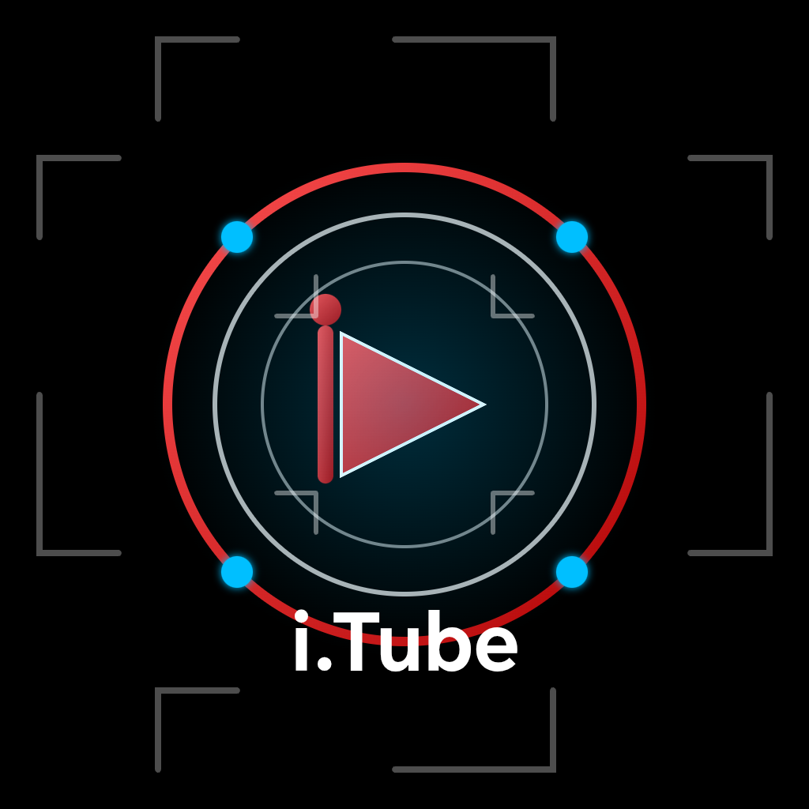

# i.Tube 🎬

A full-stack video platform built from scratch using Node.js.

i.Tube is an educational project that demonstrates how modern video platforms work, including accounts, channels, video uploading, privacy systems, likes, dislikes, subscriptions, and channel management.

The goal of this project is learning how to build a complete platform architecture similar to popular video-sharing websites.

---

# Features 🚀

## 👤 Account System

- User registration
- User login
- Secure password hashing
- JWT authentication
- Two-factor authentication (2FA)
- Current user profile
- Protected routes

---

## 📺 Channel System

Each user automatically gets their own channel.

Channel features:

- Channel name
- Channel description
- Channel image
- Subscriber system
- Public channel page
- Channel video list
- Owner-only channel editing

Users can:

- Visit any channel
- Subscribe to channels
- View public videos

Only the channel owner can:

- Edit channel information
- Change channel image
- Manage their content

---

## 🎥 Video System

Video features:

- Upload videos
- Video titles
- Video descriptions
- Public/private privacy
- Video streaming
- Range requests support
- Video views system
- Like system
- Dislike system


Video owners can:

- Edit their videos
- Change title
- Change description
- Change privacy
- Delete videos

---

## 🔒 Privacy System

Videos support:

### Public videos

Visible to everyone.

### Private videos

Only available for the owner.

---

## 👍 Interaction System

Users can:

- Like videos
- Remove likes
- Dislike videos
- Remove dislikes

The system automatically prevents:

- Liking and disliking the same video at the same time

---

# Project Architecture
VideoPlatform
│ ├── server.js │ ├── core │   └── plugin_manager.js │ ├── plugins │ │   ├── accounts │   │   ├── plugin.js │   │   └── database.json │   │ │   ├── videos │   │   ├── plugin.js │   │   └── database.json │   │ │   └── web │       └── frontend │ ├── storage │   └── videos │ └── uploads └── channels

---

# Plugin System

i.Tube uses a modular plugin architecture.

Every feature can exist as an independent plugin.

Example:
plugins/example/plugin.js

A plugin can:

- Register API routes
- Connect databases
- Add new features
- Extend the platform

This makes the project easy to expand.

---

# Technologies Used

## Backend

- Node.js
- Express
- JWT
- Multer
- LowDB
- Crypto


## Frontend

- HTML
- CSS
- JavaScript


## Storage

- JSON databases
- Local video storage

---

# API Examples

## Register
POST /accounts/register

Creates a new account and channel.


---

## Login
POST /accounts/login


Returns JWT token.


---

## Upload Video
POST /videos/upload


Requires authentication.


---

## Get Videos
GET /videos/list


---

## Visit Channel
GET /channels/:id


---

## Subscribe
POST /channels/subscribe/:id


---

# Learning Goals

This project teaches:

- Backend architecture
- REST API design
- Authentication systems
- File uploads
- Video streaming
- Database management
- Plugin architectures
- Permission systems
- Frontend-backend communication


---

# Future Improvements

Possible upgrades:

- Comments system
- Notifications
- Search engine
- Recommendations
- Cloud storage
- Database migration to PostgreSQL
- Real-time chat
- Live streaming
- Mobile application

---

# Installation

Clone the project:

```bash
git clone https://github.com/yonukwasim520-cyber/i.tube.git
```
Accessing the tool folder
```bash
cd i.Tube
```
Install dependencies:
```bash
npm install
```
Start server:
```bash
node server.js --host
```
The server runs on:
```bash
http://127.0.0.1:5900
```
Educational Purpose
i.Tube is created for learning and experimentation.
It is not intended to replace commercial platforms, but to demonstrate how large video platforms are built step by step.
